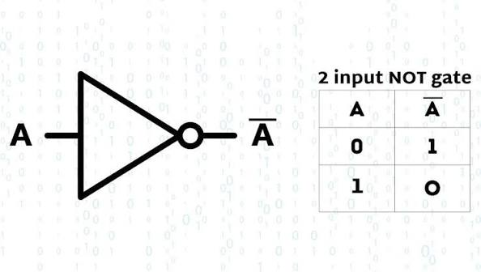
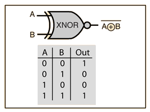
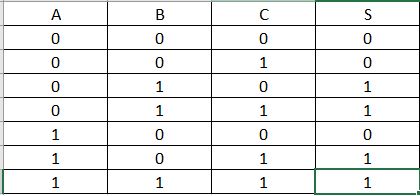
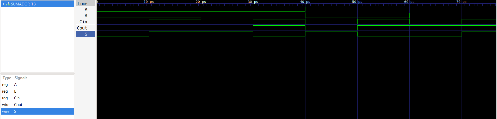

# Laboratorio 1: Introducción a la lógica combinacional

## Integrantes
* [Wilmer Fernando Puentes Gomez](https://github.com/wilmerfepuentesgo-alt)
* [Jhojan Manuel Castro Mendoza](https://github.com/casjho05)
* [Alberto Rodriguez Medina](https://github.com/22561132!)
  
## Informe

Indice:

1. [Documentación]
2. [Simulaciones]
3. [Evidencias]
4. [Conclusiones]
5. [Referencias]

## Documentación del diseño implementado

### 1. Compuertas Lógicas:

#### 1.1 Descripción:
Esta parte pretende recopilar el funcionamiento y explicación gráfica de 5 compuertas lógicas las cuales se detallaran a continuación: 

- Compuerta OR: 
La compuerta OR normalmente tiene dos entradas: A y B, y una salida Y.

TABLA DE VERDAD: 

Su expresión lógica es:

Y = A|B (En codigo)

- Compuerta AND: 
En esta compuerta las dos entradas deben estar con 1 logico para que me de señal de salida en su terminal Y 

TABLA DE VERDAD: 

Expresion logica en codigo: 
Y= A&B
- Compuerta  NOT:
La compuerta NOT es una compuerta lógica que tiene una entrada (A) y una salida (Y). Su función es invertir el valor de la entrada.

TABLA DE VERDAD: 

Expresion logica en Codigo: 
Y= Y=A⊕B​ 
Y= ~(A ^ B)

- Compuerta XOR: 
La compuerta XOR (Exclusive OR u OR exclusiva) tiene normalmente dos entradas, A y B, y una salida Y.

Su función es producir 1 cuando las entradas son diferentes.

TABLA DE VERDAD: 

Expresión lógica
Y=A⊕B

- Compuerta XNOR:
La compuerta XNOR (Exclusive NOR u OR exclusiva negada) es una compuerta lógica que tiene normalmente dos entradas (A y B) y una salida Y.

Su función es entregar 1 cuando las entradas son iguales.

Expresión lógica
Y=
A⊕B En logica Booleana
Y = ~(A ^ B) En codigo verilog.

TABLA DE VERDAD: 

#### 1.2 Diagramas
En las siguientes imagenes se detallara las compuertas en el diagrama VERILOG simulado mediante codigo hecho en Visual Code Studio  

COMPUERTA OR:

COMPUERTA AND:

COMPUERTA NOR

COMPUERTA XOR: 
[Diagrama 3](img/XOR%20VERILOG%20.png)

COMPUERTA XNOR: 
[Diagrama 4](img/XNOR%20VERILOG%20.png)

### 2. Verificador de Números Primos

#### 2.1 Descripción 
En este item se describira el funcionamiento de un detector de numeros primos en el cual de tienen tres entradas A, B, y C, con las cuales detectaremos a traves de nuestra salida S se mostrara el cuadro verilog en el cual verificamos si es primo o no el numero en cuestión

#### 2.2 Diagramas

Como se puede observar en el diagrama se muestra numeros del 0 al 7 y su comportamiento logico respecto a si es o no un numero primo detectando un 1 lógico si es primo y un 0 lógico si no lo es. 

TABLA DE VERDAD: 

### 3. Sumador de 1 Bit

#### 3.1 Descripción 

En este ultimo Ítem mostraremos el funcionamiento de un sumador de 1 Bit con acarreo incluido. Un sumador de un bit con acarreo (también llamado sumador completo o full adder) es un circuito lógico que suma dos bits de entrada más un acarreo de entrada, generando un bit de suma y un acarreo de salida
Entradas: A y B (los dos bits a sumar), y Cin (el acarreo de entrada proveniente de una suma anterior).Salidas: S (la suma resultante) y Cout (el acarreo de salida).

#### 3.2 Diagramas
 SIMULACION EN VERILOG DEL SUMADOR: 
 

## Simulaciones 

### 1. Simulación de compuertas
## OR

## AND

## NOT

## XOR

## XNOR

### 2. Simulacion Verificador Numeros Primos

### 3. Simulación de Sumador de 1 Bit

## Evidencias de implementación

### 1. Compuertas
LINK DEL VIDEO: [VIDEO COMPUERTAS](https://youtu.be/w6aTGyuoSmg)

### 2. Verificador de Números Primos 

LINK DEL VIDEO: [VIDEO DETECTOR PRIMOS](https://www.youtube.com/watch?v=8zMkII2FFtE)
### 3. Sumador de 1 Bit
LINK DEL VIDEO: [VIDEO SUMADOR 1 BIT](https://www.youtube.com/watch?v=j9EFlaOhfn8)

## CODIGOS EN VISUAL: 
COMPUERTA OR: Archivo .v
module OR (
    input wire  E1, // ENTRADA 1 
    input wire  E2, // ENTRADA 2
    output wire  S // SALIDA COMPUERTA
);
assign S= E1||E2;
endmodule

Archivo TB.v
`include "OR.V"
`timescale 1ps/1ps

module ORTB (
);
reg E1_TB;
reg E2_TB;
wire S_TB;

OR uut
(
    .E1(E1_TB),
    .E2(E1_TB),
    .S(S_TB)
);
    initial begin
      // CASO 1

      E1_TB = 1'b0;
      E2_TB = 1'b0;
      #5;

      // CASO 2
      E1_TB = 1'b0;
      E2_TB = 1'b1;
      #5;

        // CASO 3
      E1_TB = 1'b1;
      E2_TB = 1'b0;
      #5;

      // CASO 4 
      E1_TB = 1'b1;
      E2_TB = 1'b1;
      #5;
    end
    
    initial begin
        $dumpfile("OR_TB.vcd");
        $dumpvars(0, uut);
        #20;
        $finish;
    end
endmodule

COMPUERTA AND:
Archivo .v:
module AND(
    input wire A,
    input wire B,
    output wire Y
);

    assign Y = A & B;

endmodule

Archivo TB.v: 
`include "AND.V"
`timescale 1ns/1ps

module AND_TB;

    reg A;
    reg B;
    wire Y;

    AND uut (
        .A(A),
        .B(B),
        .Y(Y)
    );

    initial begin
        $dumpfile("AND_TB.vcd");
        $dumpvars(0, AND_TB);

        $monitor("A = %b, B = %b, Y = %b", A, B, Y);

        A = 0; B = 0;
        #10 A = 0; B = 1;
        #10 A = 1; B = 0;
        #10 A = 1; B = 1;
        #10 $finish;
    end

endmodule

COMPUERTA NOT: 
Archivo .v: 
module NOT (
    input  wire A,
    output wire Y
);

    // Operador ~ realiza la inversión lógica (NOT)
    assign Y = ~A;

endmodule

Archivo TB.v: 
`timescale 1ns/1ps

module NOT_TB;

    reg A;
    wire Y;

    NOT uut (
        .A(A),
        .Y(Y)
    );

    initial begin
        $dumpfile("NOT_TB.vcd");
        $dumpvars(0, NOT_TB);

        $monitor("A = %b, Y = %b", A, Y);

        A = 0;
        #10 A = 1;
        #10 A = 0;
        #10 $finish;
    end

endmodule

COMPUERTA XNOR: 
Archivo .v: 
odule XNOR (
    input wire E1,
    input wire E2,
    output wire S
);
    assign S=(E1&&E2)||(!E1&&!E2);

endmodule

Archivo TB.v: 
`include "XNOR.V"
`timescale 1ps/1ps 

module XNOR_TB (
);
reg E1_TB;
reg E2_TB;  
wire S_TB;

XNOR uut
(
    .E1(E1_TB),
    .E2(E2_TB),
    .S(S_TB)
);
    initial begin
      // CASO 1

      E1_TB = 1'b0;
      E2_TB = 1'b0;
      #5;

      // CASO 2
      E1_TB = 1'b0;
      E2_TB = 1'b1;
      #5;

        // CASO 3
      E1_TB = 1'b1;
      E2_TB = 1'b0;
      #5;

      // CASO 4 
      E1_TB = 1'b1;
      E2_TB = 1'b1;
      #5;
    end
    initial begin
        $dumpfile("XNOR_TB.vcd");
        $dumpvars(-1, uut);
        #20;
        $finish;
    end    
endmodule

COMPUERTA XOR: 
Archivo .v: 
module XOR(
    input wire A,
    input wire B,
    output wire Y
);

    assign Y = A ^ B;

endmodule

Archivo TB.v: 
`include "XOR.v"
`timescale 1ns/1ps

module XOR_TB;

    reg A;
    reg B;
    wire Y;

    XOR uut (
        .A(A),
        .B(B),
        .Y(Y)
    );

    initial begin

        $dumpfile("XOR_TB.vcd");
        $dumpvars(0, XOR_TB);

        $monitor("Tiempo=%0t | A=%b B=%b | Y=%b",
                 $time, A, B, Y);

        A = 0; B = 0;
        #10;

        A = 0; B = 1;
        #10;

        A = 1; B = 0;
        #10;

        A = 1; B = 1;
        #10;

        $finish;
    end

endmodule

## Conclusiones

- Durante el desarrollo del laboratorio se logró comprender y comprobar el funcionamiento de las principales compuertas lógicas combinacionales, como OR, AND, NOT, XOR y XNOR. A través de sus tablas de verdad y simulaciones en Verilog fue posible verificar el comportamiento de cada una de acuerdo con su expresión lógica.
- La implementación de los circuitos mediante Verilog permitió relacionar los conceptos teóricos de lógica booleana con su aplicación práctica en el diseño digital. Las simulaciones facilitaron la identificación de las diferentes combinaciones de entradas y permitieron comprobar las salidas obtenidas en cada circuito.
- El desarrollo del verificador de números primos permitió aplicar las compuertas lógicas para construir un circuito capaz de identificar, mediante tres entradas binarias, cuáles números entre 0 y 7 corresponden a números primos. Esto permitió comprender cómo pueden utilizarse circuitos combinacionales para realizar procesos de decisión.
- La implementación del sumador completo de 1 bit permitió comprender el funcionamiento de un circuito capaz de sumar dos bits considerando también un acarreo de entrada. Se comprobó la generación de la salida de suma y del acarreo de salida, elementos fundamentales para la construcción de circuitos aritméticos de mayor capacidad.
- Finalmente, el laboratorio permitió fortalecer las habilidades en el uso de Verilog y en la simulación de circuitos digitales, demostrando la importancia de combinar los fundamentos de lógica digital con herramientas de programación y simulación para diseñar, comprobar y analizar sistemas digitales.
## Referencias

- Harris, D. M., & Harris, S. L. (2012). Digital Design and Computer Architecture (2nd ed.). Morgan Kaufmann/Elsevier. El libro aborda compuertas lógicas, diseño combinacional, ecuaciones booleanas, circuitos aritméticos y Verilog.
- Harris, S. L., & Harris, D. M. (2021). Digital Design and Computer Architecture: RISC-V Edition. Morgan Kaufmann/Elsevier. Presenta los fundamentos del diseño lógico digital y el desarrollo de circuitos combinacionales y secuenciales.
- IEEE. (2001). IEEE Standard Verilog Hardware Description Language (IEEE Std 1364-2001). Institute of Electrical and Electronics Engineers. Esta norma define el lenguaje Verilog HDL para el desarrollo, verificación, síntesis y prueba de diseños electrónicos.
- Icarus Verilog. (s. f.). Icarus Verilog Documentation. Documentación oficial sobre compilación, simulación y uso de Verilog, incluyendo herramientas para visualizar formas de onda. Icarus Verilog Documentation
- Harris, S. L., & Harris, D. M. (2024). Digital Design & Computer Architecture: RISC-V Edition – Chapter 1. Harvey Mudd College. Material de apoyo sobre sistemas binarios y compuertas lógicas como AND, OR, NOT, XOR y XNOR.