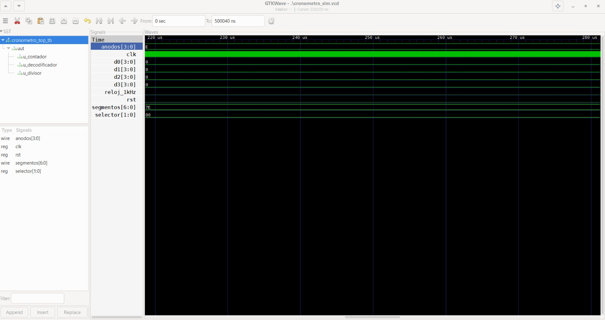

# LABORATORIO 03: IMPLEMENTACION DEL 7 SEGMENTOS 

## Integrantes
* [Wilmer Fernando Puentes Gomez](https://github.com/wilmerfepuentesgo-alt)
* [Jhojan Manuel Castro Mendoza](https://github.com/casjho05)
* [Alberto Rodriguez Medina](https://github.com/22561132!)
  
## INFORME

Indice:

1. [Documentación]
2. [Simulaciones]
3. [Evidencias]
4. [Conclusiones]
5. [Referencias]

### 1. DOCUMENTACION:

#### OBJETIVO:
Implementar un cronómetro digital capaz de contar segundos, décimas, centésimas y milésimas de segundo, visualizando el resultado en el display de 7 segmentos integrado en la FPGA.

#### MARCO TEÓRICO:

##### Lógica Secuencial: 

La lógica secuencial es una rama de la electrónica digital que estudia sistemas cuyo comportamiento depende no solo de las entradas actuales, sino también del historial de estados anteriores. A diferencia de la lógica combinacional —donde la salida es función exclusiva de las entradas presentes— en los sistemas secuenciales la salida evoluciona según la secuencia de eventos pasados, lo que les permite recordar información.

### COMPONENTES Y PRINCIPIOS FUNDAMENTALES:

##### Flip-Flops: 

Los flip-flops son los elementos de memoria básicos de la lógica secuencial. Cada uno almacena un bit de información y mantiene su estado hasta recibir una señal de activación proveniente del reloj del sistema. Los tipos más utilizados son:

Tipo D – Captura el valor de la entrada en el flanco activo del reloj.
Tipo T – Conmuta su estado cada vez que la entrada está activa.
Tipo SR – Permite Set y Reset independientes de su salida.
Tipo JK – Generalización del SR que elimina el estado prohibido.

Este es un tipo de Flip Flop con Set y Reset y un Reloj o contador de pulsos. 

##### Registros
Un registro es un conjunto de flip-flops que opera de forma coordinada para almacenar múltiples bits de información. Los registros de desplazamiento, en particular, permiten mover datos entre flip-flops adyacentes con cada pulso de reloj, siendo una operación fundamental en muchos sistemas digitales.

##### Contadores
Los contadores son circuitos construidos a partir de flip-flops encadenados, diseñados para llevar la cuenta de pulsos de reloj. Según su configuración, pueden contar en secuencia binaria, BCD, Gray u otras codificaciones.

### SIMULACIONES: 

A continuacion se mostraran los resultados de la sintetizacion en Verilog de las siguientes simulaciones: 
- Divisor de Frecuencia 
- Cronometro (Archivo Test Bench)
- Contador de 4 Bits 
- Decodificador Multiplexor

#### DIVISOR DE FRECUENCIA: 

En esta imagen observamos el espectro de Frecuencia programado en 1KHz la señal de Reset y el Reloj el cual esta programado en 1KHz

#### CRONOMETRO: 

En esta imagen se muestra la entrada del multiplexor con sus cuatro entradas D0, D1, D2 y D3 representando la maxima cantidad de bits para este 

