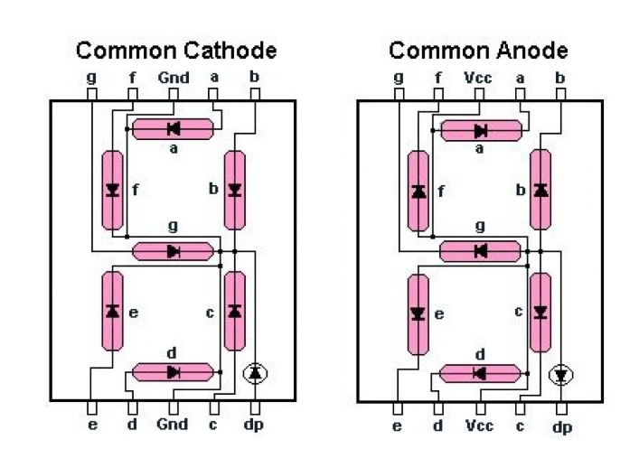

# LABORATORIO 03: IMPLEMENTACION DEL 7 SEGMENTOS 

## Integrantes
* [Wilmer Fernando Puentes Gomez](https://github.com/wilmerfepuentesgo-alt)
* [Jhojan Manuel Castro Mendoza](https://github.com/casjho05)
* [Alberto Rodriguez Medina](https://github.com/22561132!)
  
## INFORME

Indice:

1. [Documentación]
2. [Simulaciones]
3. [Evidencias]
4. [Conclusiones]
5. [Referencias]

### 1. DOCUMENTACION: 
### Objetivo.
El objetivo de este laboratorio es lograr visualizar el resultado de un sumador de 3 bits en los display 7 segmentos de la tarjeta de desarrollo DE10-Lite.

### Fundamento teórico
#### 1. BCD (Binary Coded Decimal):
BCD significa Décimal Codificado en Binario y representa el sistema de numeración digital en el que podemos representar cada número décimal utilizando 4 bits de números binarios.

Como sabemos hay 10 dígitos en el sistema décimal, para representarlos necesitamos 10 combinaciones de 4 bits binarios.

Ahora bien, también es posible representar de forma binaria los números décimales del 10 al 15 pero empleando su correspondiente representación en el sistema hexadécimal:

#### 2. Display 7 Segmentos: 
El display de siete segmentos es un dispositivo electrónico que consta de siete diodos emisores de luz (LED) dispuestos en un patrón definido; encender una combinación particular de éstos permite representar un dígito décimal o hexadécimal Existen dos tipos de display LED de siete segmentos:

Tipo de cátodo común: en este tipo de display, todos los cátodos de los siete LEDs están conectados entre sí a tierra o 
−Vcc (por lo tanto, cátodo común) y el LED muestra dígitos cuando se suministra un nivel alto a los ánodos individuales.

Tipo de ánodo común: en este tipo de display, todos los ánodos de los siete LEDs están conectados a 
+Vcc (por lo tanto, ánodo común) y el LED muestra dígitos cuando se suministra un nivel al bajo a los cátodos individuales.

En las siguientes figuras se muestra cómo se distribuyen los 7 segmentos en el display cuando se tiene una configuración de ánodo común:

## SIMULACIONES: 

A continuacion se muestran los codigos implementados y su respectiva sintetizacion en Verilog el cual nos muestra la simulacion del conteo de 0 a 7 y luego la suma implementada a traves de nuestro sumador de 4 Bits.

### Codigo en Visual Code 7 Segmentos: 

`include "sumador_bit.v"

`timescale 1ns/1ps

module SUMADOR4B_TB;

    // Entradas del diseño (reg)
    reg [3:0] A;
    reg [3:0] B;
    reg Cin;

    // Salidas del diseño (wire)
    wire [3:0] S;
    wire Cout;

    integer i,j;

    // Instancia de la unidad bajo prueba (UUT)
    sumador_bit uut (
        .A(A),
        .B(B),SUMADOR4B_TB.vcd
        .Cin(Cin),
        .S(S),
        .Cout(Cout)
    );

    initial begin
        // Crear el archivo de ondas para GTKWave
        $dumpfile("");
        $dumpvars(0, SUMADOR4B_TB);

Cin=0;
for(i=0; i<16; i=i+1) begin
    for(j=0; j<16; j=j+1) begin
        A = i; // Asignar valor a A
        B = j; // Asignar valor a B
        
        #10; // Esperar 10 unidades de tiempo
    end
end
        $display("Simulación terminada correctamente.");
        $finish;
    end

endmodule

### Sintetizado en Verilog: 

Explicacion del sintetizado en Verilog: 
La tabla que se muestra a continuacion nos da a entender el lenguaje de salida de nuestro Display 7 Segmentos: 

Esto nos indica que nuestro display enciende cuando hay un 1 logico a su salida lo que nos da a entender que enciende con 1 y apaga con 0. Esto para la configuracion de Catodo Común. 

Sin embargo al momento de cargar nuestro codigo a Verilog nos muestra la configuracion de Anodo Comun el cual nos dice que enciende con 0 y apaga con 1. 

En la siguiente tabla se mostrara que resultado de salida para cada uno de los digitos en Verilog evidenciada en la Imagen 3: 

Aqui evidenciamos que las salidas para cada uno de los digitos o numeros coincide con las mostradas en nuestra grafica Verilog esto con la configuracion del display 7 segmentos con Anodo Común 

## EVIDENCIAS: 

A continuacion veremos en un video el funcionamiento en fisico de nuestro laboratorio sumador con 7 Segmentos. 

### LINK DEL VIDEO: 
.

